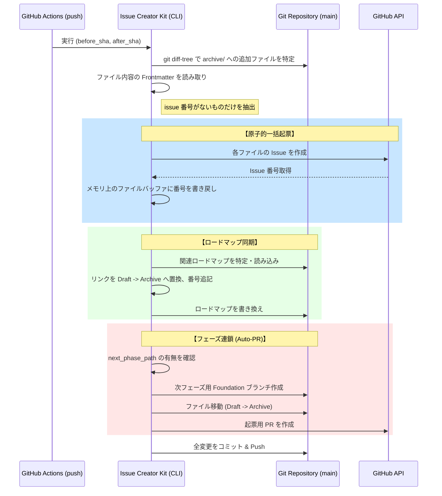

# 概要 / Overview
デザインドキュメント: 仮想キューとフェーズ連鎖の論理フロー詳細設計 (ADR-003 実装詳細)

- **Author(s)**: TECHNICAL_DESIGNER
- **Status**: 下書き
- **Last Updated**: 2026-01-04

## 背景と課題 / Background
ADR-003 において、物理的な `_queue` フォルダを廃止し、`archive/` へのマージ差分をトリガーとする「仮想キュー」方式への移行が決定された。
しかし、以下の詳細なロジックが未定義であり、実装上の曖昧さが残っている。
1.  **差分検知の厳密性**: 他の変更と混ざった場合に、起票対象ファイルだけを正確に抽出する方法。
2.  **原子性の保証**: ネットワークエラー等で一部の Issue 起票が失敗した際の状態不整合（二重起票や書き込み漏れ）の防止。
3.  **ロードマップ同期の確実性**: ロードマップ内のリンク（Markdown テーブル）を破壊せずに、正規表現等で安全に置換・追記する方法。
4.  **フェーズ連鎖の安全装置**: 自己増殖的な PR 作成による無限ループや、コンフリクト発生時の自動停止。

## ゴール / Goals
- 開発者が PR をマージするだけで、後続フェーズの準備（Auto-PR）とロードマップ更新が全自動かつ安全に完了する。
- 異常発生時には「何もしない（Fail-fast）」ことで、SSOT である Git リポジトリの整合性を 100% 維持する。
- スパイク調査（`docs/spikes/git-diff-logic.md`）で得られた知見を統合し、実機で動作可能なアルゴリズムを確定させる。

## 設計 / Design

### ハイレベル設計 / High-Level Design
GitHub Actions (push to main) を起点とした一連のフローを以下に示す。

### 詳細設計 / Detailed Design

#### 1. 差分検知アルゴリズム (Virtual Queue Detection)
- **コマンド**: `git diff-tree -r --no-commit-id --name-status --diff-filter=A --no-renames ${before} ${after} -- reqs/tasks/archive/`
- **フィルタリングルール**:
    1.  取得したファイルリストのうち、拡張子が `.md` であるもの。
    2.  各ファイルの YAML Frontmatter をパースし、`issue` フィールドが存在しない、あるいは空であるもの。
- **エッジケース**: 一つの PR で複数のフェーズ（フォルダ）のファイルが `archive/` に入った場合も、ICK はそれらを一括で処理対象とする。

#### 2. 原子的一括起票 (Atomic Batch Creation)
- **All-or-Nothing 戦略**:
    - 全ての対象ファイルについて、Issue 作成 API をコールする。
    - **1件でも失敗した場合**: すでに作成された Issue を削除（または Close）しようとするのではなく、処理を中断してエラーを吐き、Git への書き戻しコミットを行わない。
    - **成功時**: メモリ上の各ファイルオブジェクトに Issue 番号をセットし、次工程へ渡す。

#### 3. ロードマップ同期 (Roadmap Sync Engine)
- **置換ロジック**:
    - ロードマップ Markdown ファイルを 1 行ずつスキャン、または正規表現置換を行う。
    - `| (Task ID) | ... | [ファイル名](../../tasks/drafts/(パス)) |` 形式の行を特定。
    - `../../tasks/drafts/` を `../../tasks/archive/` に置換。
    - リンクテキストの末尾、または備考欄に ` (#IssueNumber)` を追記する。
- **安全策**: 置換対象のリンクが見つからない場合、そのファイルについてはスキップし警告ログを出すが、他のファイルの同期は継続する。

#### 4. フェーズ連鎖と Auto-PR (Phase Chaining)
- **トリガー条件**:
    - 今回起票された（`archive/` に入った）ファイルの中に、`next_phase_path` メタデータを持つものが存在すること。
- **処理フロー**:
    1.  `next_phase_path` (例: `reqs/tasks/drafts/phase-2/`) の存在を確認。
    2.  `git checkout -b feature/phase-N-foundation` を実行。
    3.  指定パス内の全ファイルを `reqs/tasks/archive/` 側の対応ディレクトリへ物理移動。
    4.  `git add . && git commit -m "feat: promote phase-N tasks for virtual queue"`
    5.  `git push origin feature/phase-N-foundation`
    6.  GitHub API で PR を作成。`base: main`, `head: feature/phase-N-foundation`。
- **無限ループ防止**:
    - `next_phase_path` が指す先が、既に `archive/` 配下に存在するディレクトリである場合は、二重処理とみなして無視する。
    - PR 作成時に、同一の `head` ブランチ名が既に存在する場合も、安全のため処理をスキップする。

#### 5. 安全装置 (Safety Mechanisms)
- **Fail-fast**: 以下のいずれかで失敗した場合は、即座に終了し、Git リポジトリを汚さない（Push しない）。
    - ネットワークエラーによる API 失敗。
    - `git push` 時のコンフリクト（別の Actions や人間による変更）。
- **冪等性**: `issue` 番号が既に Frontmatter にあるファイルは無視するため、Actions が再試行されても二重起票は発生しない。

## 検討した代替案 / Alternatives Considered
- **案: Issue 作成直後に逐次コミット**: コミットログが汚れ、ロードマップ更新との整合性が取りにくいため却下。「一括処理・一括コミット」を採用。
- **案: `archive/` 移動を Actions 内で行う**: 人間が PR で「どのタスクを完了とするか」を明示的に操作する（レビューする）プロセスを重視するため、現在の「マージ後に起票」案を採用。

## セキュリティとプライバシー / Security & Privacy
- `GITHUB_TOKEN` の権限として、`contents: write` (コミット用) および `issues: write` (起票用) が必要。
- 秘密情報の漏洩はないが、自動 PR 作成により意図しない通知が飛ぶ可能性があるため、ロードマップでの事前定義を SSOT とする。

## 未解決の問題 / Open Questions & Unresolved Issues
- 大量（100件以上）の Issue を一括起票する場合の API レートリミット対策（必要に応じてスリープを入れるべきか）。

## 検証基準 / Verification Criteria
- [ ] 模擬リポジトリにおいて、`drafts/` から `archive/` へのファイル移動を含む PR をマージした際、Actions が発火し、Issue が起票されること。
- [ ] 起票された Issue の番号が、元の md ファイルの Frontmatter に正しく書き戻されていること。
- [ ] ロードマップ内のリンクが `drafts` から `archive` に書き換わり、Issue 番号が付与されていること。
- [ ] `next_phase_path` がある場合、次フェーズの移動 PR が自動作成されること。
- [ ] 途中でネットワークを切断した際、中途半端な Issue 番号の書き込みやロードマップ更新が行われないこと（原子性）。
