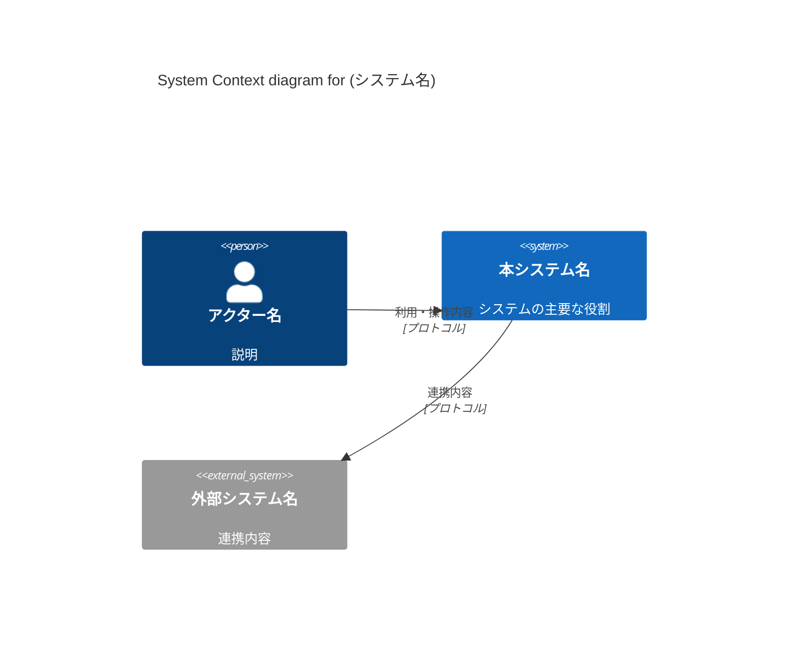

# システムコンテキスト: (システム名)

このドキュメントは、システムの全体像、境界、および主要な依存関係を定義する、プロジェクトの Single Source of Truth (SSOT) です。

- **Status**: (作成中 | 承認済み | 更新中)
- **Last Updated**: YYYY-MM-DD

## 1. ビジネスコンテキストとアウトカム
<!-- 
【思考の指針: アウトカム志向 & 顧客価値の探求】
- このシステムは「誰の、どのような課題」を解決するために存在するのか？
- ユーザーにどのような「良い変化（アウトカム）」をもたらすのか？
-->

## 2. 主要なユビキタス言語 (Ubiquitous Language Core)
<!-- 
【思考の指針: ドメインへの集中】
- 境界を越えて全エージェント・開発者が一貫して使用すべき、ドメインの核心となる用語（3〜5個）を定義します。
-->
| 用語 | 定義 | 備考 |
| :--- | :--- | :--- |
| (例: 資産) | システムが管理対象とする物理的・論理的リソースの総称 | |

## 3. システムの境界と責務 (System Boundary)
<!-- 
【思考の指針: 全体最適 & 境界づけられたコンテキスト】
- システムが「責任を持つ範囲」と「外部に任せる範囲」を明確に区別します。
-->

### 3.1 スコープ内 (In-Scope)
- (例: リアルタイムな資産状況の視覚化)

### 3.2 スコープ外 (Out-of-Scope)
- (例: 物理デバイスの制御そのもの（エッジゲートウェイ側に閉じる）)

## 4. アクターと外部システム (Actors & External Systems)

### 4.1 アクター (ユーザー)
| アクター名 | 役割 / 目的 |
| :--- | :--- |
| (例: 一般ユーザー) | データの閲覧と分析を行う |

### 4.2 外部システム
| システム名 | 連携内容 / プロトコル |
| :--- | :--- |
| (例: PostgreSQL) | コアデータの永続化 / 強力な一貫性が必要 |

## 5. アーキテクチャ図 (C4 Model - System Context)
<!-- 
【思考の指針: 概念的整合性】
- Mermaid を用いて、システムと周囲の要素との関係を視覚化します。
-->

## 6. 戦略的トレードオフと 4 大リスク
<!-- 
【思考の指針: トレードオフの分析 & 4大リスクへの挑戦】
- 「何を得るために、何を諦めるか」を明文化します。
- 生存性（Viability）や実現可能性（Feasibility）上の最大の懸念を記録します。
-->
- **(例: パフォーマンス vs 一貫性):** データの正確性を最優先とし、分散トランザクションによるレイテンシを許容する。
- **(例: 最大のリスク):** 外部APIの可用性に依存しており、API停止時の代替運用が課題。

## 7. 設計原則とデータ信頼性 (Design Principles & Kleppmann's View)
<!-- 
【思考の指針: クリーンアーキテクチャ & データ指向設計】
- 開発者が迷った際の判断基準となる原則を記述します。
-->
- **(原則1):** ビジネスロジックは外部フレームワークの詳細から保護されること（Clean Architecture）。
- **(原則2):** データの信頼性と再現性を担保するため、すべての状態変更はイベントログとして記録する。
- **(原則3):** 進化するアーキテクチャ：MVP以降の拡張を妨げないよう、外部インターフェースは疎結合に保つ。
